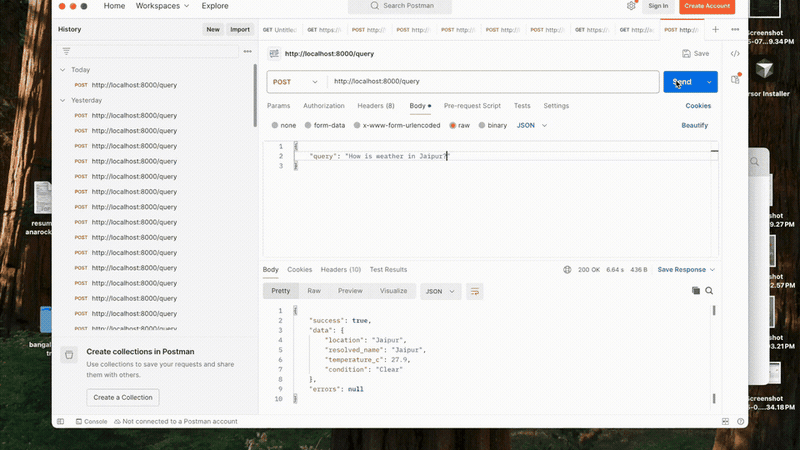

# AI Intent Router

A Django REST API that accepts natural-language queries, classifies intent with an LLM, routes to the right tool, and returns structured JSON.

---

## Problem Statement

Users often ask questions in plain language — weather, currency conversion, summaries, order lookups — but traditional APIs require callers to know which endpoint to hit and how to format parameters. Bridging free-form text to the correct backend action is non-trivial without an intent layer.

This assignment asks for a single entry point that understands what the user wants and executes the matching function automatically.

---

## Solution

This service exposes one `POST /query` endpoint. Each request is classified by an LLM into a supported intent with extracted parameters, then routed to a dedicated tool (weather API, currency API, LLM summary, or PostgreSQL-backed order/invoice logic). Results are returned in a consistent `{ success, data, errors }` envelope. Every attempt is logged to the database; Redis caching and per-IP rate limiting reduce load on external services.

---

## Assumptions

- **No user authentication** — the API is public as per the scope of the assignment.
- **Rate limiting by client IP** — 10 requests per minute per IP (Redis).
- **Demo data** — order and invoice tools use seeded sample data (`python manage.py seed_demo_data`), not a live production catalog.

---

## Demo

`POST /query` with a natural-language weather question (Postman):

<p align="center">
  
</p>

---

## Tech Stack

| Requirement | Implementation |
|-------------|----------------|
| **Python** | Python 3.x |
| **Web framework** | Django 6.0 + Django REST Framework 3.17 |
| **LLM provider** | Ollama (local) or Google Gemini (cloud) |
| **Database** | PostgreSQL 16 |
| **Cache / throttling** | Redis 7 (Django `RedisCache` backend) |
| **HTTP clients** | `httpx` (LLM), `requests` (external tools) |
| **Configuration** | `django-environ` (`.env` file) |
| **Containers** | Docker Compose (Postgres + Redis) |

---

## Setup & Run

### Prerequisites

- Python 3.11+
- Docker (for PostgreSQL and Redis)
- [Ollama](https://ollama.com/) (if using the local LLM provider)

### Install and run

```bash
# Clone and enter the project
cd ai-intent-router

# Python virtual environment
python3 -m venv .venv
source .venv/bin/activate        # Windows: .venv\Scripts\activate
pip install -r requirements.txt

# Environment — copy .env.example and add API keys (see below)
cp .env.example .env

# Infrastructure (PostgreSQL + Redis)
docker compose up -d

# Database
python manage.py migrate
python manage.py seed_demo_data

# (Optional) Django admin user
python manage.py createsuperuser

# Start the server
python manage.py runserver
```

- Admin: http://127.0.0.1:8000/admin/

### Run tests

```bash
python manage.py test
```

### Environment

Set required API keys in `.env` (for example `GEMINI_API_KEY`, `WEATHERAPI_API_KEY`, `EXCHANGERATE_API_KEY`). All other settings use sensible defaults — see [`.env.example`](.env.example) for the full list.

### Ollama (local LLM)

```bash
ollama serve
ollama pull gemma3:4b
```

Set `LLM_PROVIDER=ollama` in `.env` (defaults and model name are in `.env.example`).

### Gemini (cloud LLM)

Set `LLM_PROVIDER=gemini` and `GEMINI_API_KEY` in `.env` (see `.env.example`).

---

## Request Flow

```
                              ┌─────────┐
                              │ Client  │
                              └────┬────┘
                                   │
                    POST /query  { "query": "..." }
                                   │
                                   ▼
┌──────────────────────────────────────────────────────────────────────────────┐
│ QueryAPIView                                                                 │
├──────────────────────────────────────────────────────────────────────────────┤
│                                                                              │
│  [0] Rate limit          ScopedRateThrottle · Redis · 10 req/min per IP      │
│           │ exceeded  (logged via api_exception_handler)                     │
│           └──────────────────────────────────────────────►  HTTP 429         │
│                                                                              │
│  [1] Validate body       required · non-blank · max 2000 chars               │
│           │ invalid                                                          │
│           └──────────────────────────────────────────────►  HTTP 400         │
│                                                                              │
│  [2] IntentClassifier                                                        │
│           │                                                                  │
│           ├─ get_llm_provider()  ──►  Ollama  |  Gemini                      │
│           ├─ LLM response        ──►  intent · confidence · parameters       │
│           │                                                                  │
│           │  confidence < 0.65  or  intent = UNKNOWN                         │
│           └──────────────────────────────────────────────►  HTTP 422         │
│           │                                                                  │
│           │  LLM misconfigured / provider error                              │
│           └──────────────────────────────────────────────►  HTTP 500 / 502   │
│                                                                              │
│  [3] ToolRouter                    route by classified intent                │
│           │                                                                  │
│           ├─ WEATHER_QUERY       ──►  WeatherTool   ──►  WeatherAPI.com      │
│           │                                              (Redis cache · 1h)  │
│           ├─ CURRENCY_CONVERSION ──►  CurrencyTool  ──►  ExchangeRate-API    │
│           │                                              (Redis cache · 1h)  │
│           ├─ TEXT_SUMMARY        ──►  SummaryTool   ──►  LLM                 │
│           │                                              (Redis cache · 24h) │
│           ├─ ORDER_LOOKUP        ──►  OrderTool     ──►  PostgreSQL          │
│           └─ INVOICE_GENERATION  ──►  InvoiceTool   ──►  PostgreSQL          │
│                                                                              │
│  [4] Response                { success, data, errors }  (200 or 4xx/5xx)     │
│                                                                              │
├──────────────────────────────────────────────────────────────────────────────┤
│  [5] QueryHistory.record     PostgreSQL  (view finally · throttle handler)   │
└──────────────────────────────────────────────────────────────────────────────┘
                                   │
                                   ▼
                              ┌─────────┐
                              │ Client  │
                              └─────────┘
```

---

## Project Structure

```
ai-intent-router/
├── manage.py
├── requirements.txt
├── docker-compose.yml
├── .env.example
├── docs/assets/                # README demo GIF
├── ai_intent_router/           # Django project settings
└── apps/router/                # Main application
    ├── views.py                # QueryAPIView
    ├── models.py               # QueryHistory, Customer, Order, OrderItem, Invoice
    ├── services/               # IntentClassifier, ToolRouter, CacheService
    ├── llm/                    # Factory, providers, prompts, schemas
    ├── tools/                  # Weather, Currency, Summary, Order, Invoice
    └── tests/
```

---

## Features

1. **Factory pattern — pluggable LLM providers**  
   LLM selection uses a Factory (`get_llm_provider()`) backed by a provider registry. Ollama runs locally for development; Gemini is used for cloud deployment. Both implement `BaseLLMProvider`, so adding another LLM (OpenAI, Claude, etc.) means registering a new class — no changes to the view or classifier.

2. **External tool integrations**  
   - **Weather** — Fetches current conditions from [WeatherAPI.com](https://www.weatherapi.com/docs/) using the location extracted by the LLM.  
   - **Currency** — Fetches exchange rates from [ExchangeRate-API](https://www.exchangerate-api.com/docs/pair-conversion-requests); the converted amount is computed in-app from the cached rate.

3. **Redis caching**  
   - Weather (`weather:{location}`) — TTL **1 hour**  
   - Currency (`currency_rate:{FROM}:{TO}`) — TTL **1 hour**  
   - Text summary (`summary:{sha256(text)}`) — TTL **24 hours**  
   Order lookup and invoice generation are not cached as they are dynamic and critical data — they read live PostgreSQL data.

4. **Rate limiting**  
   `POST /query` is limited to **10 requests per minute per client IP** via DRF `ScopedRateThrottle`, with counters stored in Redis. Exceeded requests return HTTP `429` and are logged to query history.

5. **Query history**  
   Every request — including validation failures, rate limits, and LLM errors — is recorded in the `query_history` table with the original query, LLM output, tool response, status, and processing time. Records are viewable in Django admin.

6. **Dockerization**  
   Infrastructure dependencies are containerized with Docker Compose — run `docker compose up -d` to start PostgreSQL 16 (host port `5433`) and Redis 7 (port `6379`) with named volumes for persistent storage. The Django app runs on the host during local development and connects via `DATABASE_URL` and `REDIS_URL` in `.env`.

7. **Test coverage**  
   **55 automated tests** across nine modules exercise the intent classifier, tool router, external tools (HTTP mocked), Redis cache, query history and throttling, LLM factory/schemas, summary tool, and HTTP status mapping for user-facing errors. Run with `python manage.py test`.

---

## API Reference

### `POST /query`

**Request body**

```json
{
  "query": "<natural language string, max 2000 characters>"
}
```

All examples below use:

```bash
curl -X POST http://127.0.0.1:8000/query \
  -H "Content-Type: application/json" \
  -d '{"query": "<your query here>"}'
```

### HTTP status codes

Every response uses the `{ success, data, errors }` envelope. The HTTP status reflects the outcome:

| Situation | HTTP status |
|-----------|-------------|
| Tool succeeded | `200 OK` |
| Invalid request body or tool input (e.g. bad amount, missing parameter) | `400 Bad Request` |
| Resource not found (order, location, currency pair) | `404 Not Found` |
| Unsupported intent / invalid business input (e.g. order status) | `422 Unprocessable Entity` |
| Rate limit exceeded | `429 Too Many Requests` |
| Summary LLM failure (tool layer) | `502 Bad Gateway` |
| External tool or service unavailable | `503 Service Unavailable` |
| Classification LLM failure | `502 Bad Gateway` |
| LLM misconfiguration | `500 Internal Server Error` |

---

### 1. Weather query (`WEATHER_QUERY`)

**Sample request**

```bash
curl -X POST http://127.0.0.1:8000/query \
  -H "Content-Type: application/json" \
  -d '{"query": "What is the weather in Mumbai?"}'
```

**Success** — `200 OK`

```json
{
  "success": true,
  "data": {
    "location": "Mumbai",
    "resolved_name": "Mumbai",
    "temperature_c": 32.0,
    "condition": "Partly cloudy"
  },
  "errors": null
}
```

**Error** — `404 Not Found` (invalid location)

```json
{
  "success": false,
  "data": null,
  "errors": {
    "location": ["Could not find weather information for that location."]
  }
}
```

---

### 2. Currency conversion (`CURRENCY_CONVERSION`)

**Sample request**

```bash
curl -X POST http://127.0.0.1:8000/query \
  -H "Content-Type: application/json" \
  -d '{"query": "Convert 100 USD to INR"}'
```

**Success** — `200 OK`

```json
{
  "success": true,
  "data": {
    "amount": "100",
    "from_currency": "USD",
    "to_currency": "INR",
    "conversion_rate": "83.5",
    "converted_amount": "8350.0000",
    "rate_last_updated_utc": "Fri, 30 May 2026 00:00:00 +0000"
  },
  "errors": null
}
```

**Error** — `404 Not Found` (unsupported currency pair)

```json
{
  "success": false,
  "data": null,
  "errors": {
    "currency": ["Could not fetch an exchange rate for those currencies."]
  }
}
```

---

### 3. Text summary (`TEXT_SUMMARY`)

**Sample request**

```bash
curl -X POST http://127.0.0.1:8000/query \
  -H "Content-Type: application/json" \
  -d '{"query": "Summarize: Django is a high-level Python web framework that encourages rapid development and clean, pragmatic design."}'
```

**Success** — `200 OK`

```json
{
  "success": true,
  "data": {
    "summary": "Django is a Python web framework focused on rapid development and clean design.",
    "source_length": 108
  },
  "errors": null
}
```

**Error** — `502 Bad Gateway` (LLM failure)

```json
{
  "success": false,
  "data": null,
  "errors": {
    "summary": ["Could not generate a summary right now. Please try again later."]
  }
}
```

---

### 4. Order lookup (`ORDER_LOOKUP`)

**Sample request**

```bash
curl -X POST http://127.0.0.1:8000/query \
  -H "Content-Type: application/json" \
  -d '{"query": "Find all pending orders"}'
```

**Success** — `200 OK`

```json
{
  "success": true,
  "data": {
    "status": "pending",
    "count": 1,
    "orders": [
      {
        "id": 2,
        "customer_name": "John Smith",
        "customer_email": "john@example.com",
        "status": "pending",
        "total_amount": "75.00",
        "currency": "USD",
        "created_at": "2026-05-30T10:00:00+00:00"
      }
    ]
  },
  "errors": null
}
```

**Error** — `422 Unprocessable Entity` (invalid status)

```json
{
  "success": false,
  "data": null,
  "errors": {
    "status": ["Invalid status. Allowed values: pending, confirmed, processing, shipped, delivered, cancelled."]
  }
}
```

---

### 5. Invoice generation (`INVOICE_GENERATION`)

**Sample request**

```bash
curl -X POST http://127.0.0.1:8000/query \
  -H "Content-Type: application/json" \
  -d '{"query": "Generate invoice for order 123"}'
```

**Success** — `200 OK`

```json
{
  "success": true,
  "data": {
    "created": true,
    "invoice": {
      "id": 2,
      "invoice_number": "INV-000123",
      "order_id": 123,
      "status": "generated",
      "total_amount": "150.00",
      "currency": "USD",
      "generated_at": "2026-05-30T12:00:00+00:00",
      "created_at": "2026-05-30T12:00:00+00:00"
    }
  },
  "errors": null
}
```

**Error** — `404 Not Found` (order not found)

```json
{
  "success": false,
  "data": null,
  "errors": {
    "order_id": ["Order 123 does not exist."]
  }
}
```

---

### Classification & system errors

These apply when the LLM cannot map a query to a supported intent, or when infrastructure fails before tool execution.

**Unsupported intent** — `422 Unprocessable Entity`

```bash
curl -X POST http://127.0.0.1:8000/query \
  -H "Content-Type: application/json" \
  -d '{"query": "Tell me a joke"}'
```

```json
{
  "success": false,
  "data": null,
  "errors": {
    "classification": ["Could not determine a supported intent for this query."]
  }
}
```

**Validation error** — `400 Bad Request`

```json
{
  "success": false,
  "data": null,
  "errors": {
    "query": ["Query must not be empty."]
  }
}
```

**Rate limit** — `429 Too Many Requests`

Send more than 10 requests within one minute from the same IP. The 11th request returns:

```json
{
  "success": false,
  "data": null,
  "errors": {
    "rate_limit": ["Rate limit exceeded. Please try again later."]
  }
}
```

**LLM unavailable** — `502 Bad Gateway`

```json
{
  "success": false,
  "data": null,
  "errors": {
    "llm": ["Could not process your query right now. Please try again later."]
  }
}
```

---

## Database Tables

```
Customer 1──* Order 1──* OrderItem
                │
                └──1──1 Invoice

QueryHistory (standalone audit log)
```

| Table | Purpose | Key columns |
|-------|---------|-------------|
| `query_history` | Audit log for every API request | `query_text`, `llm_output` (JSON), `tool_response` (JSON), `status`, `processing_time_ms`, `created_at` |
| `customers` | Customer records for orders | `name`, `email` (unique) |
| `orders` | Order headers | `customer_id` (FK), `status`, `total_amount`, `currency` |
| `order_items` | Line items per order | `order_id` (FK), `item_name`, `quantity`, `unit_price`, `total_price` |
| `invoices` | Generated invoices (one per order) | `invoice_number` (unique), `order_id` (OneToOne FK), `status`, `total_amount`, `generated_at` |

Load demo data for order/invoice testing:

```bash
python manage.py seed_demo_data
```

---

## Future Improvements

1. **User authentication** — OAuth or JWT; scope rate limits and query history to authenticated users.
2. **Additional LLM providers** — register OpenAI or Claude in the factory registry with minimal code changes.
3. **Query history API** — expose a `GET /history` endpoint so clients can retrieve past interactions without Django admin.
4. **Intent response caching** — cache LLM classification for frequently repeated queries (same text → skip re-classification).
5. **Async invoice generation** — return immediately and generate invoices in a background worker.
6. **Database indexing** — add indexes on hot lookup columns (e.g. order status, customer email) to speed up order and invoice queries.
